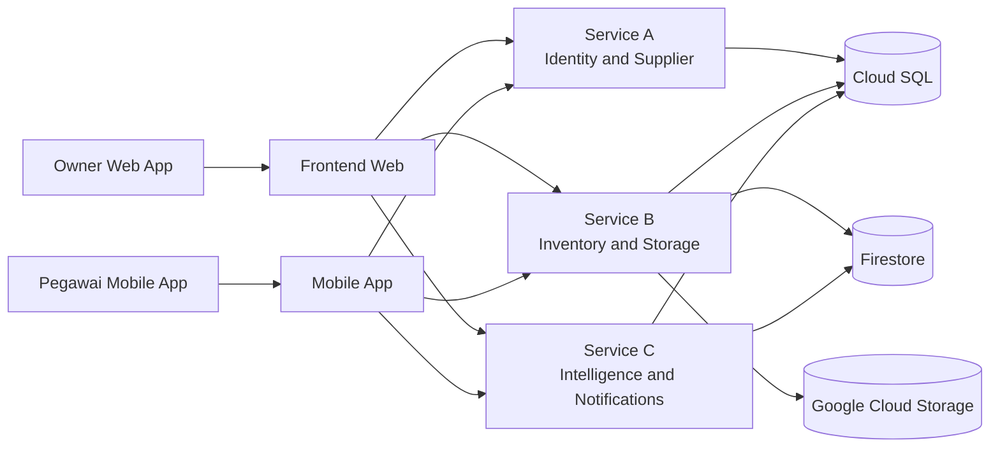
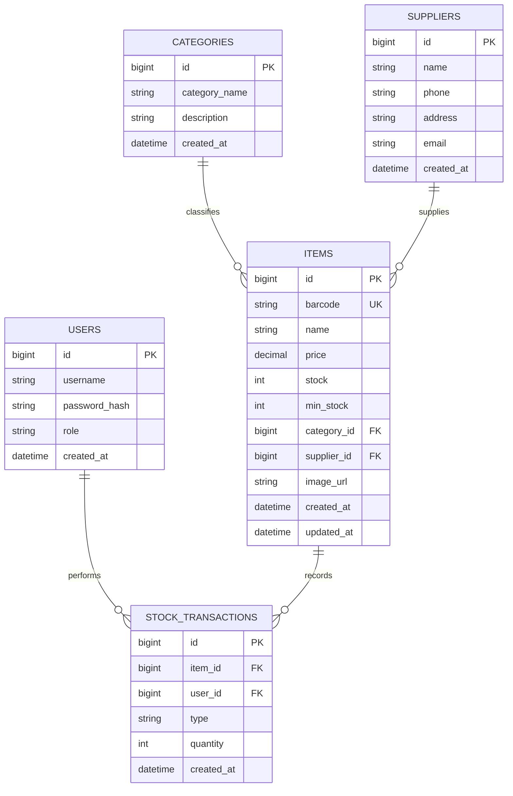
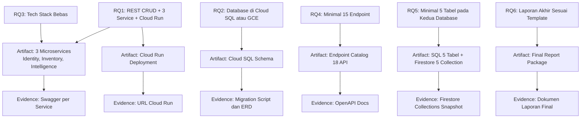
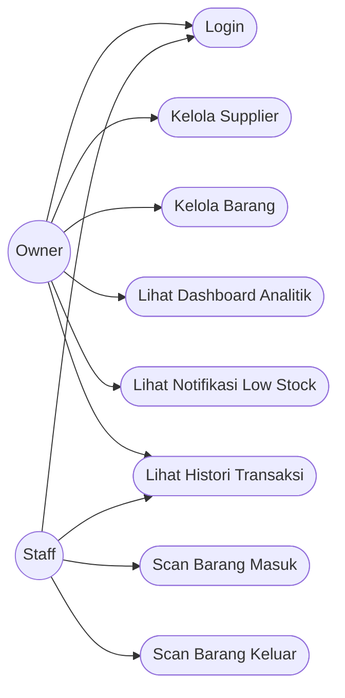
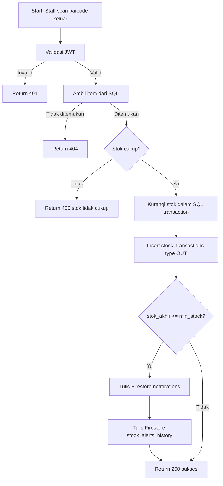
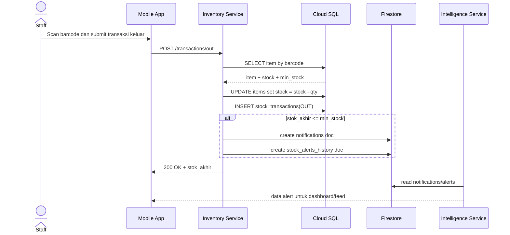
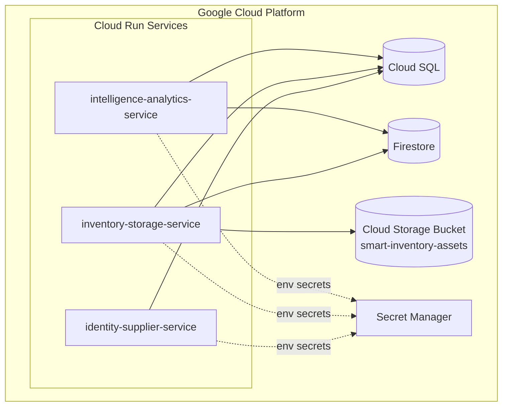
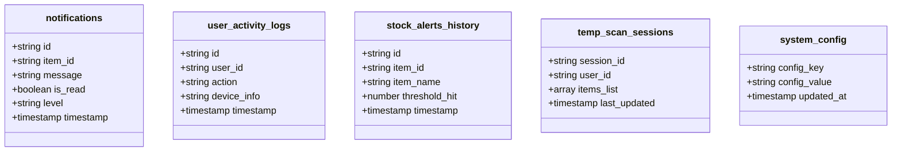

# Mermaid Diagrams Smart Inventory UMKM

Dokumen ini berisi kumpulan diagram utama untuk laporan akhir: arsitektur, ERD/RAT, use case, flow proses, sequence, dan deployment.

## 1. System Context dan Integrasi Layanan

## 2. ERD SQL (5 Tabel Utama)

## 3. RAT (Requirement Traceability Diagram)

## 4. Use Case Diagram (Owner dan Staff)

## 5. Flow Diagram Proses Transaksi Keluar dan Alert

## 6. Sequence Diagram Low Stock Alert

## 7. Deployment Diagram (Cloud Run)

## 8. Diagram Struktur NoSQL (Collection Model)

## 9. Catatan Pemakaian di Laporan

- Gunakan ERD SQL pada bagian desain basis data relasional.
- Gunakan RAT untuk menunjukkan keterlacakan requirement ke artefak implementasi.
- Gunakan flow dan sequence diagram pada bagian logika stok menipis.
- Gunakan deployment diagram pada bagian arsitektur cloud.
